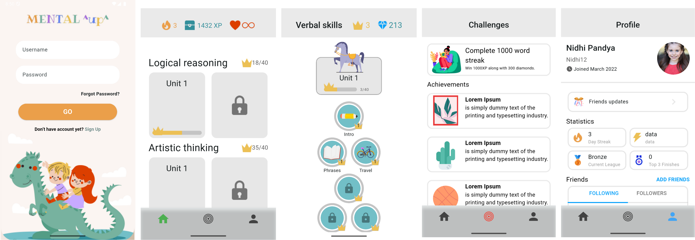

## Educational Kids Game App Development  
### Tuwaiq Academy Flutter Bootcamp

### 📘 Introduction

---
In this project, the goal is to design and implement user interfaces for an Educational Kids Game App, based on the provided Figma design. The objective is to replicate the UI exactly as shown in the Figma file [Educational Kids Game](https://www.figma.com/file/hr7vmPgtKJd95quaTZr5bt/Educational-kids-game-(Community)?type=design&node-id=0%3A1&mode=design&t=z9KUqxH5qF2QA9xp-1) to practice Flutter development and improve UI design implementation skills.


---
### 🔍 Project Overview
---




---
### ⚙️ Tech Stack
- **Flutter**
- **Dart**

---
### 💻  Setup instructions 

 1. Clone the repository:

```
https://github.com/RemasNg1/Learning-App-UI.git
```
2. Navigate to the project folder:

```
cd Learning-App-UI
```

3. Install dependencies:
```
flutter pub get
```

 4. Run the app:
 ```
 flutter run 
 ```  

---
### 📂 Folder Structure 

```
lib
   ├── main.dart
   └── screens
       ├── bottom_navbar_screen.dart
       ├── unit_screen.dart
       ├── profile_screen.dart
       ├── login_screen.dart
       ├── home_screen.dart
       └── challenges_screen.dart
       
       
```


---
### 🖊️ Author
Remas Alnugaithan


