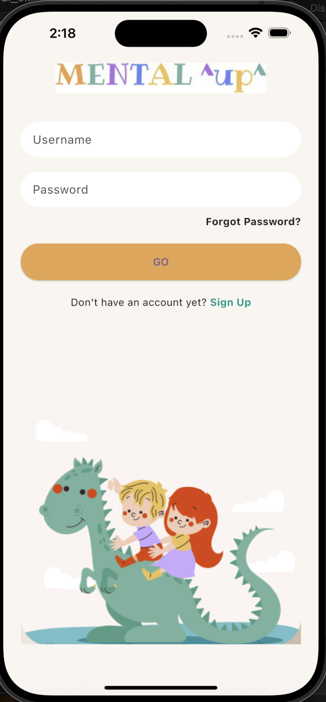
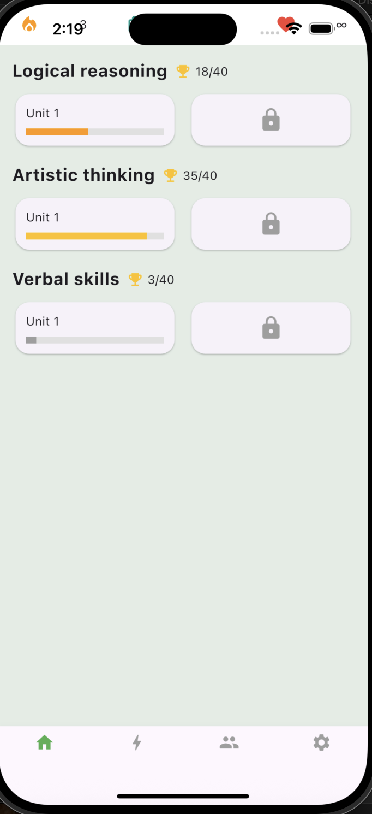
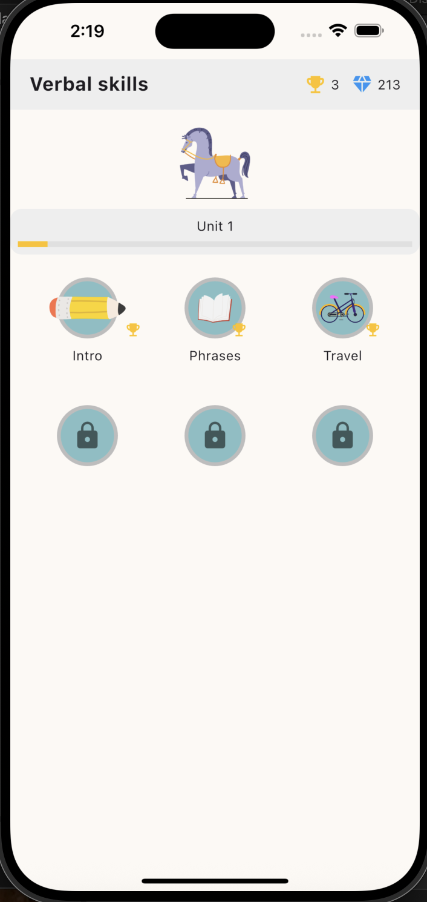
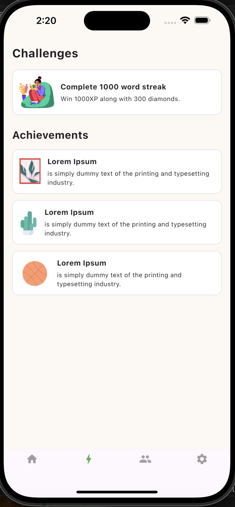
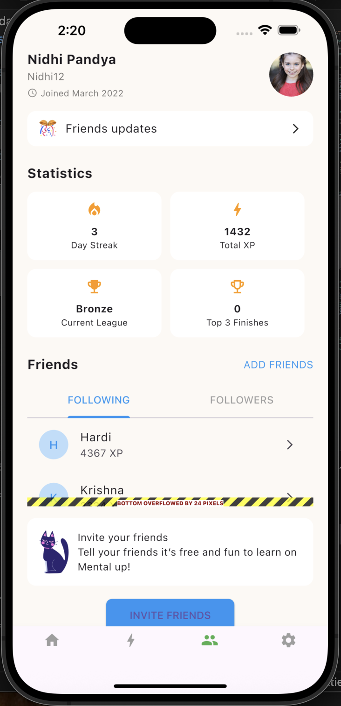

# 🎯 Flutter UI Project - Educational Kids Game

This project is a Flutter UI implementation based on a provided Figma design for an educational game targeted at children.

All screens were carefully designed to match the Figma UI exactly, and all required widgets and navigations are implemented.

---

## 📸 Screenshots

| Login | Home | Verbal Skills |
|-------|------|----------------|
|  |  |  |

| Challenges | Profile |
|------------|---------|
|  |  |

---

## 🧱 Widgets Used

The following Flutter widgets were used in the implementation:

- `Column`
- `Row`
- `ListView`
- `AppBar`
- `TextField`
- `Icon`
- `Button`
- `Image`

---

## 🔁 Navigation

- ✅ Login ➝ Home Dashboard
- ✅ Home ➝ Verbal Skills Screen
- ✅ Bottom Navigation Bar (Home / Challenges / Profile / Settings)

---

## 📁 Folder Structure

lib/
├── main.dart
├── screens/
│ ├── login_screen.dart
│ ├── home_dashboard.dart
│ ├── verbal_skills_screen.dart
│ ├── challenges_screen.dart
│ └── profile_screen.dart
├── assets/
│ ├── images/
│ └── screens/ ← ✅ Screenshots for README

---

## 👤 Auth
**Ameerah Aloufi**  

