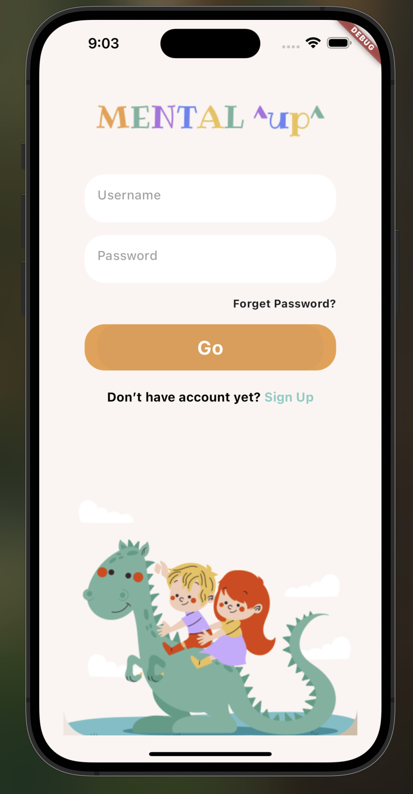
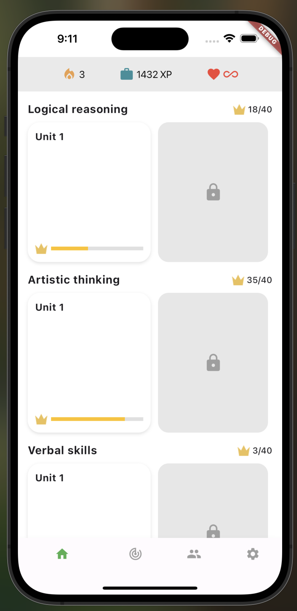
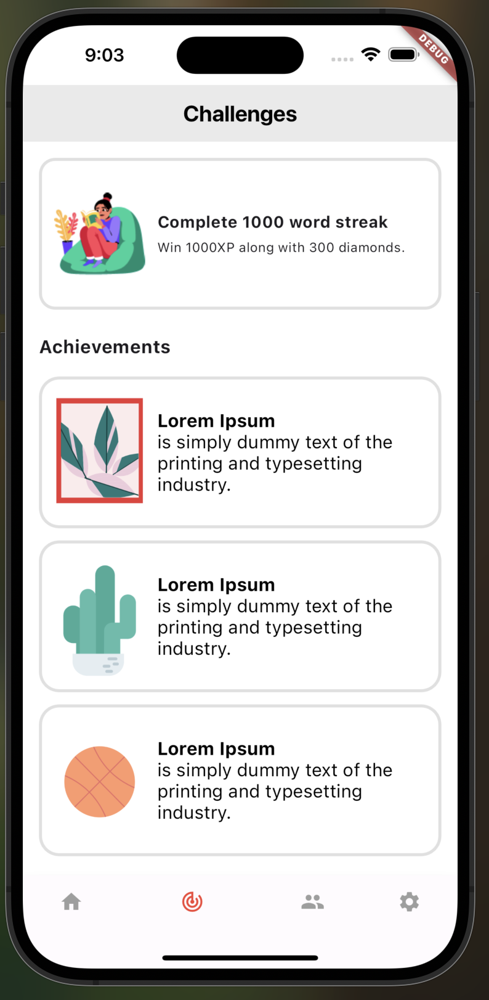
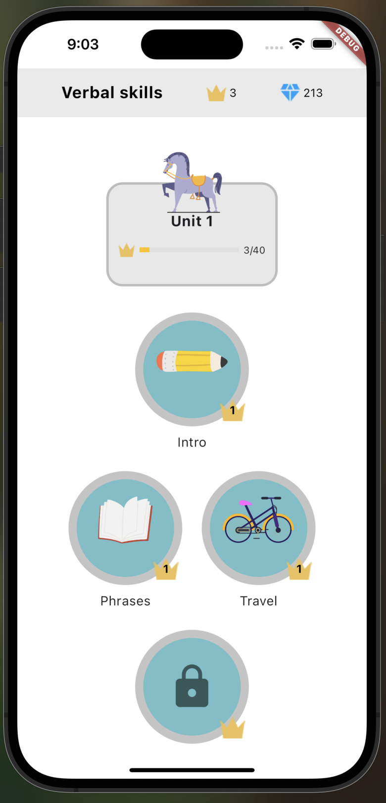
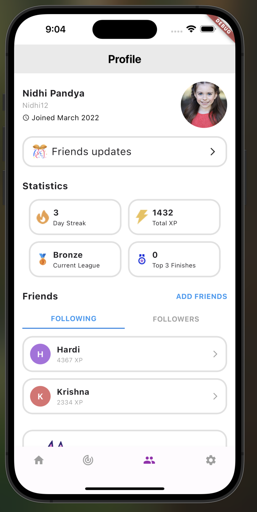
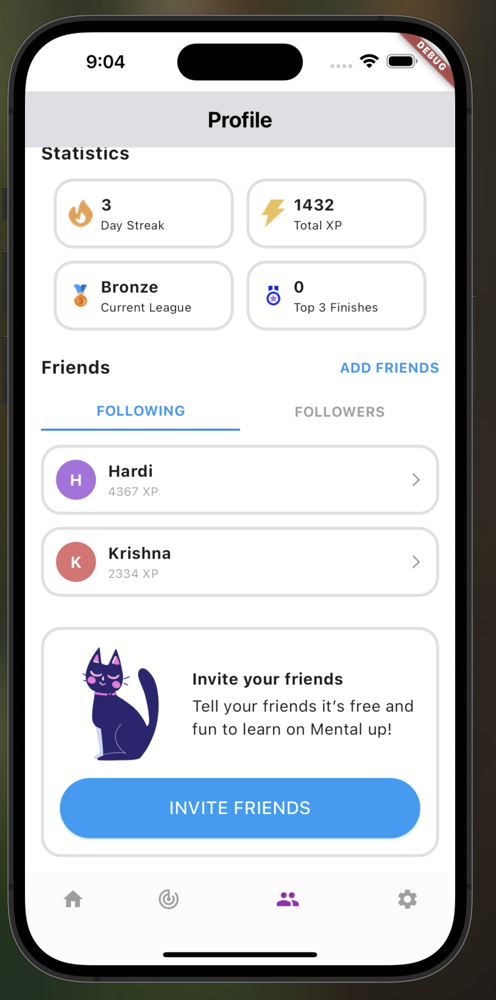

#  Educational Kids Game - Flutter UI Project

A beautiful and interactive Flutter app for kids that mimics a Figma design.  
This project focuses on building clean and responsive UI with navigation and interactivity.

---

##  Screenshots


###  Login Screen  


###  Home Screen  


###  Target Screen  


###  Verbal Skills Screen  


###  Profile Screen  



---

##  Features

- Login screen UI.
- Smooth AppBar and BottomNavigationBar with custom colors.
- Browse and track different skill categories.
- Custom progress indicators and locked units.
- Friends statistics and challenge achievements.
- Fully matches the provided Figma design.

---

## Widgets Used

- `AppBar`, `BottomNavigationBar`
- `Column`, `Row`
- `ListView`, `SingleChildScrollView`
- `TextField`, `Text`, `Icon`, `Image`
- `Button`, `GestureDetector`
- `Stack`, `Positioned`
- `Container`, `Expanded`, `Spacer`


---

##  Getting Started

```bash
# 1. Clone the repo
git clone https://github.com/manaalq/Educational-Kids-Game.git

# 2. Go to the project directory
cd Educational-Kids-Game


# 3. Install packages
flutter pub get

# 4. Run the app
flutter run

Author

Manal 
GitHub: @manaalq


