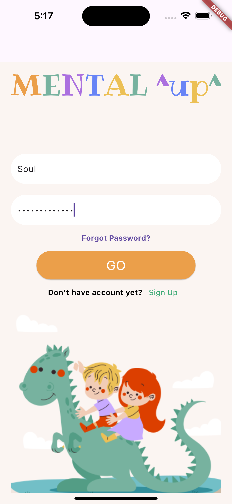
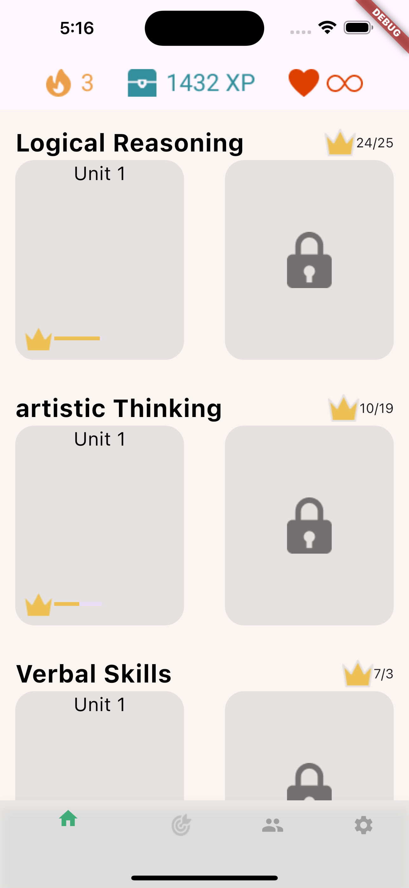
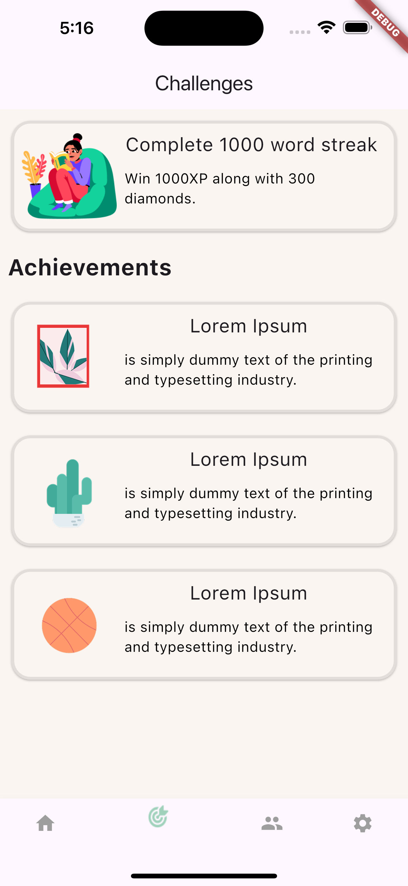
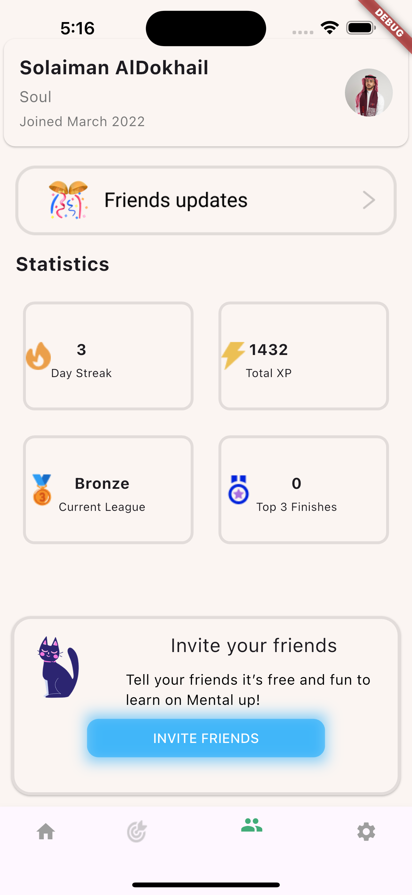
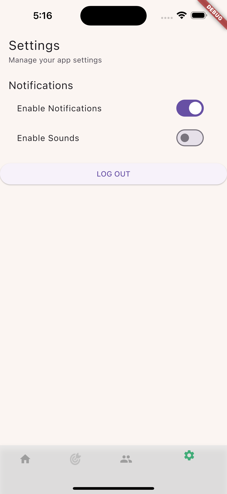

# EduKids Adventure App UI

An engaging Flutter-based educational app designed for kids, featuring a friendly login flow, fun challenges, customizable profiles, and easy-to-access settings.

## Screenshots

### Login Screen  


### Home Screen  


### Challenges Screen  


### Profile Screen  


### Settings Screen  



## Features

- **Secure Authentication**  
  - Simple, colorful UI optimized for young users.
- **Home Dashboard**  
  - Quick access to ongoing lessons, featured challenges, and progress overview.
  - Friendly avatars and large icons for easy navigation.
- **Interactive Challenges**  
  - A variety of mini-games and quizzes covering math, language, science, and more.
- **Profile Management**  
  - Personalize avatar, nickname, and learning goals.
  - Track earned badges, completed challenges, and overall progress.
- **Settings**  
  - Notification preferences.

## Tech Stack

- **Flutter** (latest stable version)  
- **Dart**  

## Installation

1. Clone the repository:
   ```bash
   git clone https://github.com/your-username/your-repo-name.git
2. Navigate to the project directory:
    ```bash
    cd your-repo-name
3. Install dependencies:
    ```bash
    flutter pub get
4. Run the app:
    ```bash
    flutter run
## How to use:
- Launch the app to start at the Login screen.

- Press Login.

- Browse the home screen for available courses and the different tabs.

- Tap a course to view its details.
##
### *Solaiman AlDokhail*
