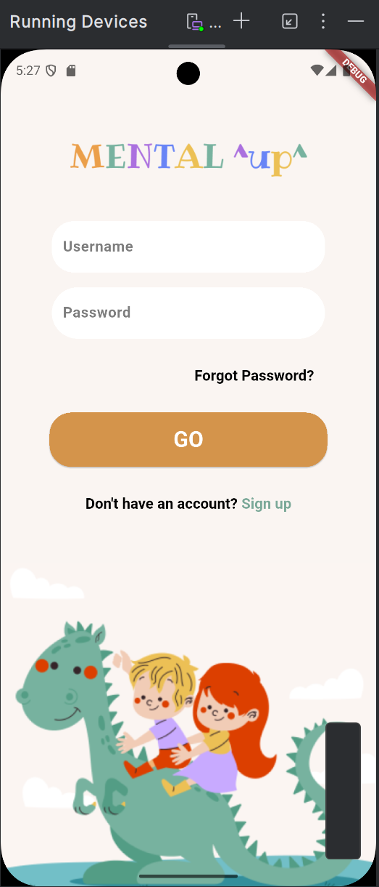
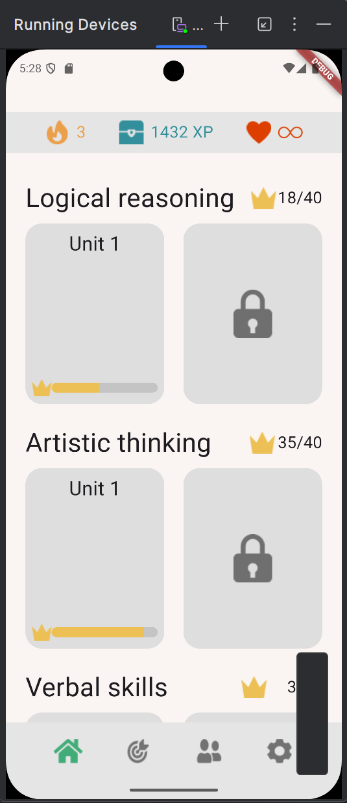
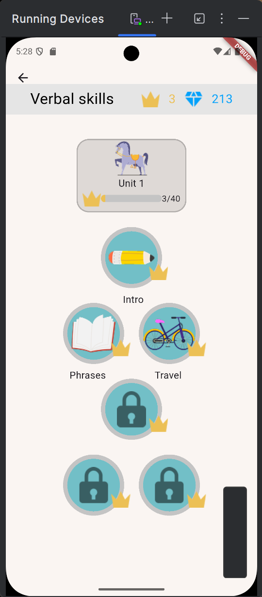
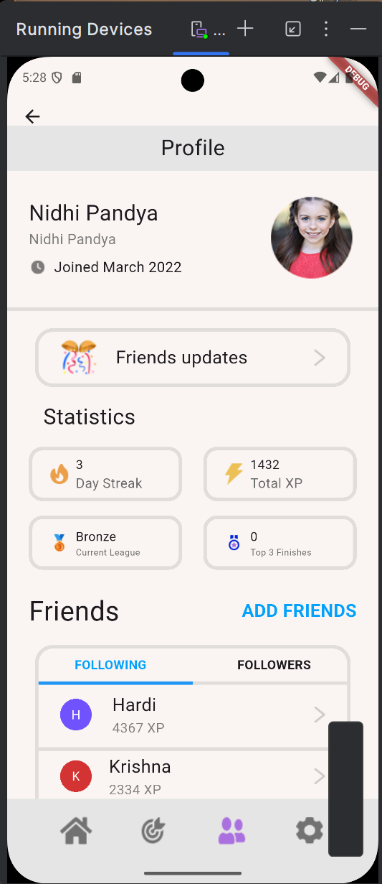
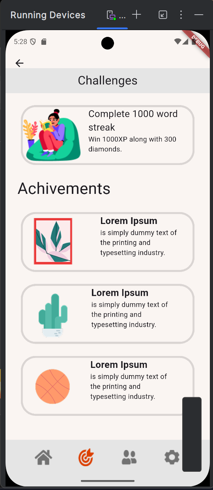

#  Educational Kids Game App


##  Screenshots

###  First Screen  



### 🎮 Game Screen  





---

##  Demo Video

> *You can upload your video to YouTube or Google Drive and paste the link here.*

[ Watch the Demo](education_kids.mp4)

---

##  Features

- Kid-friendly UI with playful colors.
- Interactive games for learning numbers and letters.
- Smooth navigation between screens.
- Includes essential Flutter widgets: `Column`, `Row`, `ListView`, `AppBar`, `TextField`, `Image`, and more.
- Fully responsive and matches the provided Figma design.

---

##  Tech Stack

- **Flutter**
- **Dart**
- **Figma Design Reference**

---

##  Project Structure

```
lib/
 models/
 screens/
   home_screen.dart
   level_selection.dart
   game_screen.dart
 widgets/
 main.dart
```

---

##  Getting Started

1. Make sure Flutter is installed on your device.
2. Clone the repository:

```bash
git clone https://github.com/your-username/kids-game-app.git
```

3. Navigate into the project folder:

```bash
cd kids-game-app
```

4. Install the dependencies:

```bash
flutter pub get
```

5. Run the app:

```bash
flutter run
```

---


